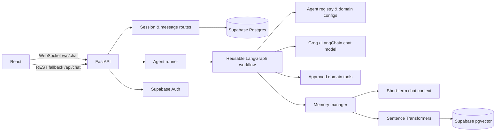

# A2Z Agentic Platform

> A full-stack, multi-agent chat platform that pairs domain-aware AI assistants with tool use, persistent conversation history, and semantic memory.

A2Z Agentic Platform is an in-progress AI engineering project built to explore how specialised assistants can share a reliable execution framework without becoming separate applications. Instead of treating an LLM as a single chat endpoint, the platform gives each assistant its own persona, safeguards, memory policy, and toolset while running all of them through one reusable LangGraph workflow.

The current product includes three focused workspaces:

- **Health Assistant** — wellness education, health-metric calculations, nutrition basics, and fitness guidance with medical-safety constraints.
- **Sports Analyst** — pace, split, 1RM, heart-rate, and training-support calculations.
- **Education Tutor** — explanations, flashcard generation, study planning, grade calculations, and word definitions.

## Why I'm building this project?

The interesting part of this project is not simply that it calls an LLM. It is the separation between **agent configuration** and **agent orchestration**. A new agent can be defined declaratively—its prompt, persona, guardrails, memory strategy, and approved tools—then registered into the shared execution graph. That keeps the system extensible while making domain behaviour explicit and reviewable.

Other strengths include:

- **Real-time first UX:** WebSocket chat streams assistant output and communicates connection, thinking, and tool-use states; REST remains available as a resilience fallback.
- **Memory designed as a subsystem:** recent messages provide short-term context, while local embeddings and Supabase/pgvector support user-scoped semantic retrieval for longer-term recall.
- **Tool-aware execution:** the workflow detects model-selected tool calls, validates the requested tool against the active agent configuration, executes it, and loops the result back into the response process.
- **Practical guardrails:** the health and sports agents carry explicit constraints for medical and injury-related questions rather than relying on a generic system prompt alone.
- **A deployable foundation:** the repository includes a Render service definition, configurable CORS, environment-based service configuration, health checks, error handling, and request rate limiting.

## Architecture



### Request Lifecycle

1. The React client opens a WebSocket connection and sends the selected agent, message, and optional session ID. If a socket is unavailable, it submits the same request to the REST chat endpoint.
2. FastAPI creates or resumes a session, persists the user message, and loads recent conversation context.
3. The runner retrieves relevant long-term memories when the agent enables them, then initializes the shared `AgentState`.
4. LangGraph prepares the prompt, asks the LLM for the next action, and routes to a final response, an approved tool call, or semantic memory retrieval. Tool and memory paths loop back into the graph, with a per-agent iteration limit to prevent runaway execution.
5. The assistant response is streamed to the client, stored with the session, embedded for future recall where enabled, and logged with latency and execution metadata.

### Repository Layout

```text
frontend/                 React single-page chat application
  src/hooks/              WebSocket lifecycle and chat-state handling
  src/components/         Chat, sidebar, agent selector, and message UI
  src/config/             Environment-aware API configuration

backend/                  FastAPI application
  agent/core/             LangGraph state, nodes, routing, runner, streaming
  agent/configs/          Per-agent prompts, tools, memory, and guardrails
  agent/tools/            Deterministic calculations and public-data adapters
  memory/                 Short- and long-term memory plus embeddings
  db/                     Supabase client, models, and CRUD operations
  auth/                   Supabase Auth service and request dependencies
  routes/                 REST endpoints and WebSocket chat handler
  middleware/             Request rate limiting
```

## Technology Choices

| Layer         | Technologies                                 | Role                                                                               |
| ------------- | -------------------------------------------- | ---------------------------------------------------------------------------------- |
| Client        | React 19, Vite, Tailwind CSS, React Markdown | Responsive chat experience with markdown responses and client-side streaming state |
| API           | Python, FastAPI, Uvicorn, Pydantic           | Typed REST and WebSocket service layer                                             |
| Agent runtime | LangChain, LangGraph, Groq                   | Configurable LLM access and graph-based control flow                               |
| Data          | Supabase Postgres, Supabase Auth, pgvector   | Authentication, sessions, messages, agent logs, and vector retrieval               |
| Retrieval     | `sentence-transformers` / `all-MiniLM-L6-v2` | Local, normalised embeddings for semantic memory                                   |
| Deployment    | Render                                       | Backend build, start, and health-check configuration                               |

## Current Capabilities

- Select health, sports, or education assistants in the chat UI.
- Create, load, list, update, and delete persisted conversation sessions.
- Receive streamed chat output, tool-status events, and automatic WebSocket reconnect attempts.
- Continue working through a REST endpoint when the WebSocket is unavailable.
- Use deterministic calculators for health, sports, study, conversion, percentage, and general mathematics tasks.
- Enrich select responses with weather, dictionary, and random-fact public APIs.
- Retrieve semantically similar memories and automatically store user/assistant exchanges for agents that enable long-term memory.
- Expose sign-up, sign-in, current-user, health, agent-discovery, session, chat, and memory-management APIs.

## Running Locally

### Prerequisites

- Python 3.10+
- Node.js 20+
- A Supabase project configured with the tables used by the application (`sessions`, `messages`, `embeddings`, and `agent_logs`) and a `match_embeddings` pgvector RPC function
- A Groq API key

### Backend

```bash
cd backend
python -m venv .venv
.venv\Scripts\activate
pip install -r requirements.txt
```

Create `backend/.env`:

```dotenv
SUPABASE_URL=https://<project-ref>.supabase.co
SUPABASE_KEY=<supabase-key>
GROQ_API_KEY=<groq-api-key>
LLM_MODEL=<Your-preferred-LLM>
ENABLE_EMBEDDINGS=true
CORS_ORIGINS=http://localhost:5173
```

Start the API:

```bash
uvicorn main:app --reload --port 8000
```

### Frontend

```bash
cd frontend
npm install
npm run dev
```

Vite proxies local `/api` traffic to `http://localhost:8000` and the client uses `ws://localhost:8000/ws/chat` in development. For a deployed frontend, set `VITE_API_URL` and, if required, `VITE_WS_URL` to the public backend URL.

## API Surface

| Endpoint                                               | Purpose                                       |
| ------------------------------------------------------ | --------------------------------------------- |
| `GET /api/health`                                      | Service health check                          |
| `GET /api/agents`                                      | Registered agent metadata and available tools |
| `POST /api/chat`                                       | Non-streaming chat execution                  |
| `WS /ws/chat`                                          | Streaming chat protocol                       |
| `/api/sessions`                                        | Conversation-session CRUD                     |
| `/api/memory/search`, `/api/memory/store`              | Semantic-memory inspection and management     |
| `/api/auth/signup`, `/api/auth/signin`, `/api/auth/me` | Supabase-backed authentication endpoints      |

Interactive API documentation is available at `/docs` while the backend is running.

## What I’m Improving Next

This is intentionally presented as a project under active development. The core architecture is in place; the next phase is about making it more observable, secure, and production-ready.

- **True end-to-end token streaming:** the WebSocket path streams model output, while the synchronous runner still simulates streaming word by word. I plan to unify this around native model streaming.
- **Production-grade rate limiting:** the current per-process, in-memory limiter is appropriate for a development baseline but will be replaced with a shared Redis-backed solution.
- **Authenticated product experience:** Supabase Auth endpoints exist, but the current browser client sends anonymous requests. The next iteration will add sign-in/sign-up flows, token propagation, and user-facing account state.
- **Authorisation hardening:** session and memory reads, updates, and deletes need explicit ownership checks before this is exposed to multiple users.
- **Evaluation and observability:** execution logs are already persisted; I’m extending this into traceable tool/LLM metrics, regression datasets, and agent-quality evaluation.
- **Tool reliability and safety:** public API adapters will gain stronger schemas, timeouts/retries, and source-aware response handling. Health guidance will continue to be bounded as educational support, not diagnosis.
- **Automated tests and CI:** the architecture is ready for focused unit tests around graph routing, tool parsing, memory retrieval, and API behaviour, followed by continuous integration.

## Engineering Perspective

I built this project to practise the parts of AI application engineering that matter beyond a chat demo: stateful workflows, constrained tool access, retrieval context, streaming UX, fault-tolerant service boundaries, and clean separation of product-specific behaviour from platform infrastructure. The next improvements are deliberately aimed at the gap between a working prototype and a trustworthy multi-user service.

## Disclaimer

The Health Assistant provides general educational and wellness information only. It is not a substitute for diagnosis, treatment, or advice from a qualified healthcare professional.
